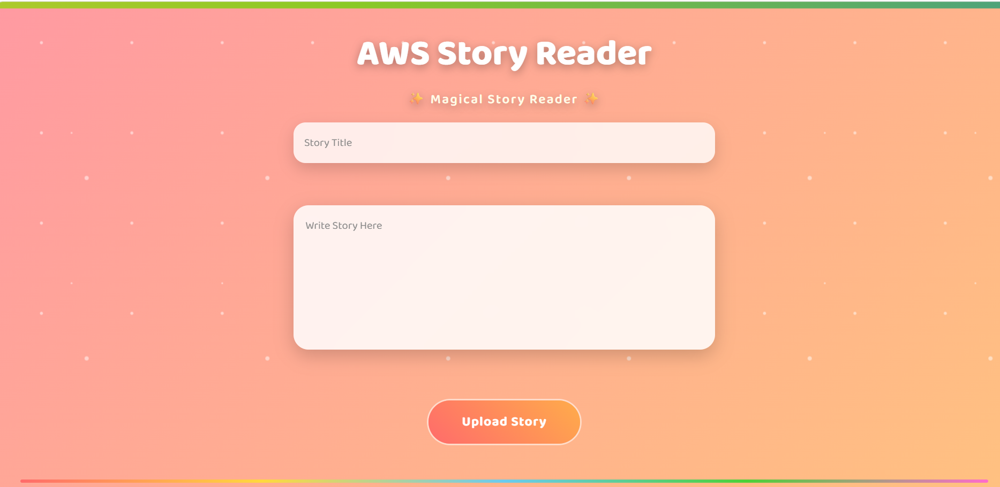
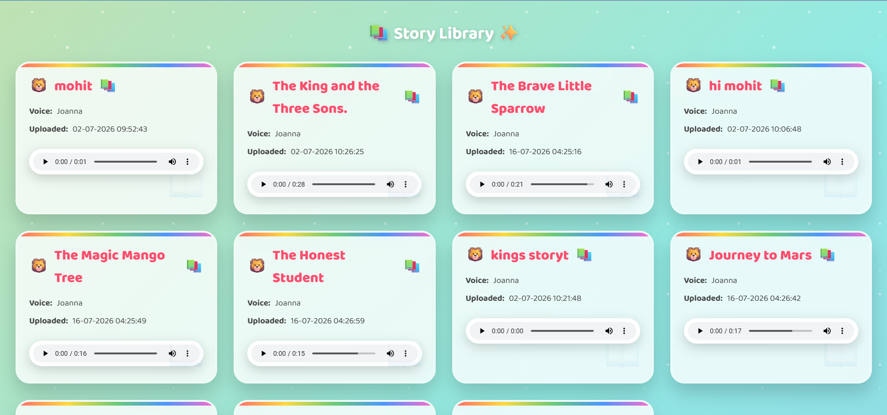
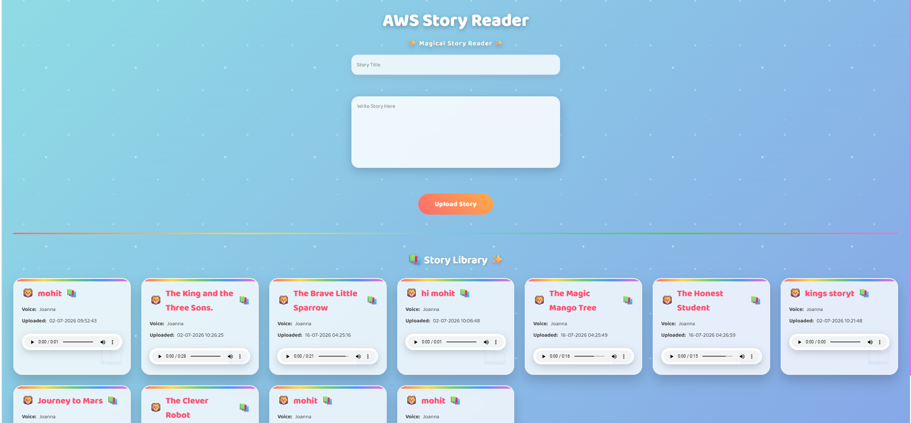
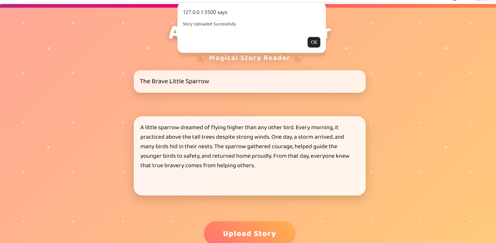
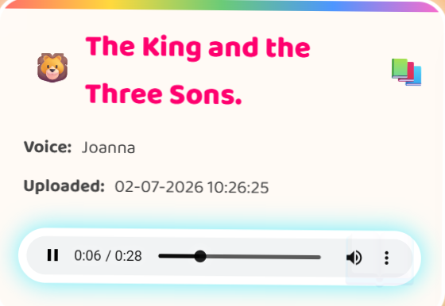
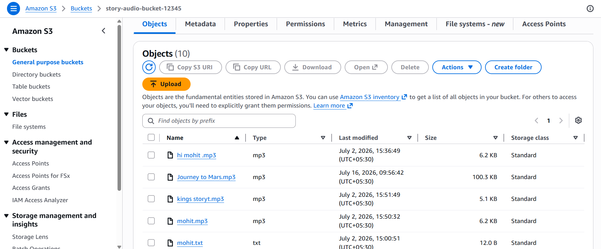
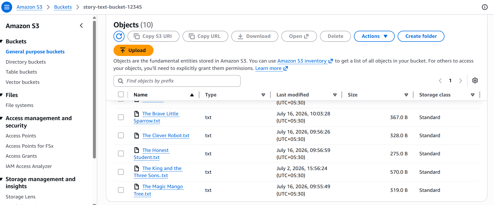

# 📚 AWS Story Reader (Amazon Polly Text-to-Speech)

AWS Story Reader is a cloud-based serverless application that converts user-written stories into natural speech using **Amazon Polly**. Users can submit a story title and content through a web interface. The application uploads the story to **Amazon S3**, triggers **AWS Lambda**, generates an MP3 audio file using **Amazon Polly**, stores the audio back in Amazon S3, saves story metadata in **Amazon DynamoDB**, and allows users to play the generated audio directly from the browser.

---

# 🚀 Features

- Upload story title and content through a web interface
- Convert text into natural speech using Amazon Polly
- Store story text in Amazon S3
- Automatically generate MP3 audio using AWS Lambda
- Save story metadata in Amazon DynamoDB
- Play generated audio directly in the browser
- Download generated MP3 files
- Event-driven serverless architecture
- Responsive and user-friendly interface

---

# ☁️ AWS Services Used

- Amazon S3
- AWS Lambda
- Amazon Polly
- Amazon DynamoDB
- Amazon API Gateway
- AWS IAM
- GitHub

---

# 💻 Technologies

- Python
- HTML
- CSS
- JavaScript
- Boto3
- Ubuntu Linux
- Git & GitHub

---

# 📂 Project Workflow

```
            User
              │
              ▼
     Story Reader Web UI
              │
              ▼
      Amazon API Gateway
              │
              ▼
         AWS Lambda
              │
              ▼
      Store Story in S3
              │
              ▼
       Amazon Polly
              │
              ▼
     Generate MP3 Audio
              │
              ▼
     Store MP3 in Amazon S3
              │
              ▼
 Save Story Metadata in DynamoDB
              │
              ▼
 Return Audio URL to the User
```

---

# 📁 Project Structure

```text
StoryReaderProject/
├── index.html
├── style.css
├── script.js
├── lambda/
│   └── lambda_function.py
├── requirements.txt
└── README.md
```

---

# 🔐 Security

- IAM Roles used for AWS service access
- No AWS Access Keys stored in source code
- Secure communication using Amazon API Gateway
- Event-driven serverless architecture
- AWS-managed authentication and permissions

---

# ⚙️ How It Works

1. User enters a story title and story content.
2. The web application sends the data to Amazon API Gateway.
3. API Gateway invokes an AWS Lambda function.
4. Lambda uploads the story text to Amazon S3.
5. Amazon Polly converts the text into speech.
6. Generated MP3 audio is stored in Amazon S3.
7. Story metadata is saved in Amazon DynamoDB.
8. The application retrieves the generated audio and plays it in the browser.

---

# 🚀 Future Enhancements

- Multiple language support
- Voice selection (Male/Female)
- Story history dashboard
- User authentication
- Audio streaming
- Speech speed control
- Story categories
- Search stories by title

---

# 👨‍💻 Author

**Nilesh Rajendra Pardeshi**

- B.Tech – Artificial Intelligence & Machine Learning
- R. C. Patel Institute of Technology, Shirpur
- AWS with Python Course Trainee (Symbiosis, Sponsored by Capgemini)

---

# ⭐ Summary

AWS Story Reader is a serverless cloud application that transforms text stories into speech using Amazon Polly. The project demonstrates an event-driven AWS architecture by integrating Amazon API Gateway, AWS Lambda, Amazon S3, Amazon Polly, and Amazon DynamoDB to automatically generate, store, and play MP3 audio files in the cloud.

---

# 📸 Project Screenshots

## Home Page



---

## Story Library



---

## Story Upload Page



---

## Story Uploaded Successfully



---

## Generated Audio Playback



---

## Amazon S3 Bucket (Generated Audio)



---

## Amazon S3 Bucket (Story Text Files)

