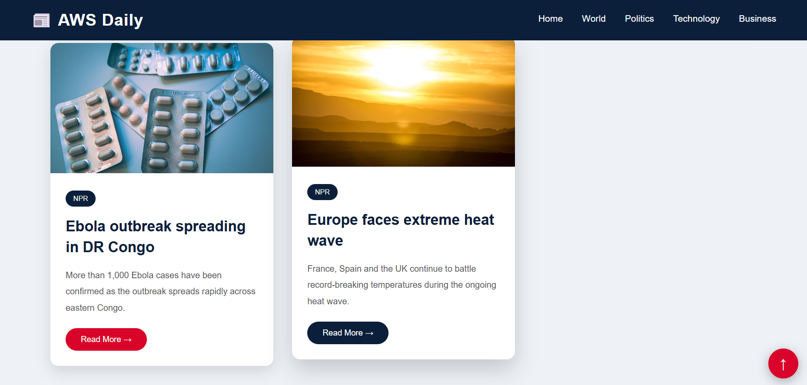
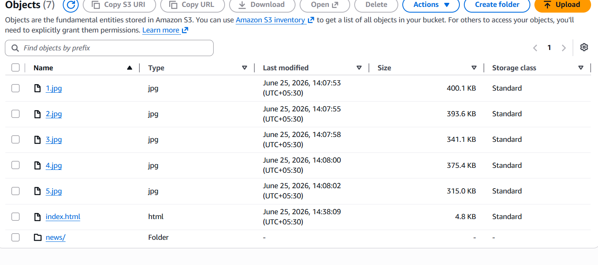

# 📰 AWS News to S3 Uploader

AWS News to S3 Uploader is a Python-based cloud application that fetches the latest news articles along with their images, stores them locally, and uploads all news data to Amazon S3. The project demonstrates AWS S3 integration using Boto3 and automates the process of organizing news content in the cloud.

---

# 🚀 Features

- Fetch Top 5 latest news articles
- Download news images automatically
- Save article details in JSON format
- Upload news data to Amazon S3
- Generate upload summary after successful upload
- Organized folder structure for images and JSON files
- AWS integration using Boto3
- Beginner-friendly cloud project

---

# ☁️ AWS Services Used

- Amazon S3
- AWS IAM
- GitHub

---

# 💻 Technologies

- Python
- Boto3
- Requests
- JSON
- Python Dotenv
- HTML
- Git & GitHub
- VS Code

---

# 📂 Project Workflow

```
          User
            │
            ▼
     Run fetch_news.py
            │
            ▼
 Fetch Top 5 News Articles
            │
            ▼
 Download News Images
            │
            ▼
 Save articles.json
            │
            ▼
 Run upload_to_s3.py
            │
            ▼
 Upload JSON to Amazon S3
            │
            ▼
 Upload Images to Amazon S3
            │
            ▼
 Generate upload_summary.json
```

---

# 📁 Project Structure

```text
Top_5_Current_News_Project/
│
├── news_data/
│   ├── images/
│   │   ├── article_1.jpg
│   │   ├── article_2.jpg
│   │   ├── article_3.jpg
│   │   ├── article_4.jpg
│   │   └── article_5.jpg
│   │
│   ├── articles.json
│   └── upload_summary.json
│
├── .env
├── fetch_news.py
├── upload_to_s3.py
├── requirements.txt
├── index.html
└── README.md
```

---

# 🔐 Security

- AWS credentials stored securely using a `.env` file
- `.env` excluded from Git using `.gitignore`
- IAM User with Amazon S3 permissions
- No credentials hardcoded in source code

---

# ⚙️ How It Works

1. Execute `fetch_news.py`.
2. The application fetches the latest five news articles.
3. News images are downloaded automatically.
4. Article information is saved into `articles.json`.
5. Execute `upload_to_s3.py`.
6. Boto3 uploads `articles.json` to Amazon S3.
7. All downloaded images are uploaded to Amazon S3.
8. A summary of uploaded files is stored in `upload_summary.json`.

---

# 🚀 Future Enhancements

- Fetch live news using NewsAPI
- Schedule automatic uploads using AWS Lambda
- Store metadata in Amazon DynamoDB
- Create a web dashboard
- Deploy on Amazon EC2
- Add search and category filters
- Generate PDF news reports

---

# 👨‍💻 Author

**Nilesh Rajendra Pardeshi**

- B.Tech – Artificial Intelligence & Machine Learning
- R. C. Patel Institute of Technology, Shirpur
- AWS with Python Course Trainee (Symbiosis, Sponsored by Capgemini)

---


# 📸 Project Screenshots

## Home Page


---

## Downloaded News Articles


---


---

## Amazon S3 Bucket



---


# ⭐ Summary

AWS News to S3 Uploader is a Python application that collects the latest news articles, downloads related images, and securely uploads both JSON data and images to Amazon S3 using Boto3. The project demonstrates practical cloud storage integration, file management, and AWS automation concepts.

