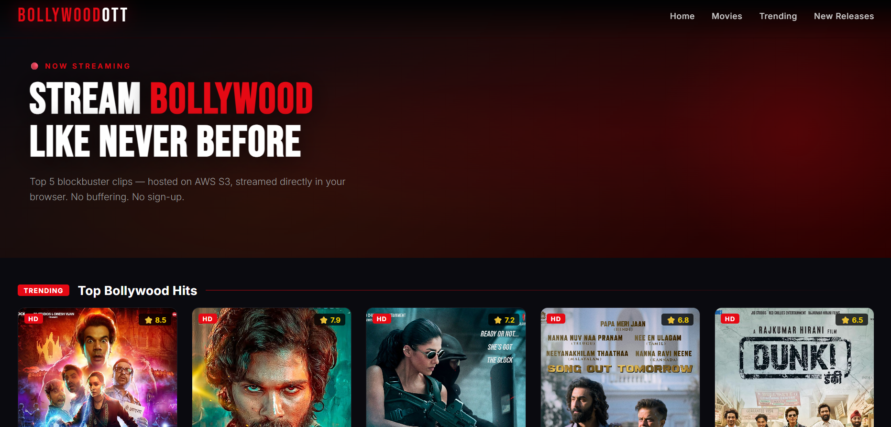
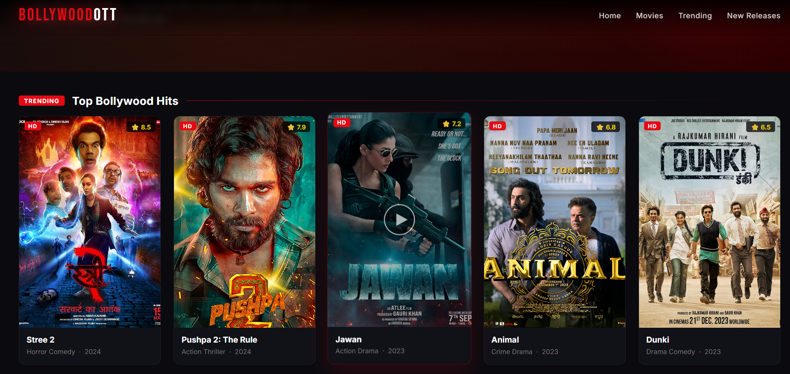
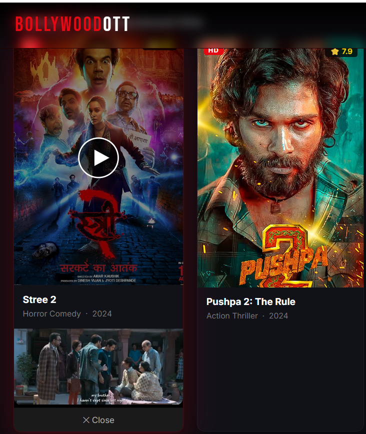
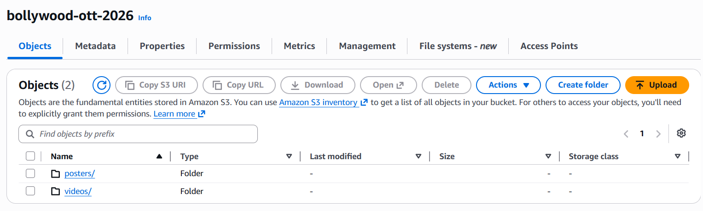

# 🎬 BollywoodOTT – Cloud Video Streaming Platform on AWS

BollywoodOTT is a Netflix-style cloud video streaming platform developed using Python and AWS. The application uploads Bollywood movie clips and poster images to Amazon S3, automatically generates a responsive OTT website, launches an Amazon EC2 instance, deploys the website using Python, and streams videos directly from S3 without using Nginx or FileZilla.

---

# 🚀 Features

- Upload Bollywood movie clips and posters to Amazon S3
- Automatically generate OTT-style HTML website
- Launch Amazon EC2 instance using Python (Boto3)
- Automatically deploy website to EC2
- Stream videos directly from Amazon S3
- Responsive Netflix-inspired UI
- Fully automated deployment using Python
- No Nginx or FileZilla required

---

# ☁️ AWS Services Used

- Amazon EC2
- Amazon S3
- AWS IAM
- AWS VPC
- Security Groups
- GitHub

---

# 💻 Technologies

- Python
- Boto3
- HTML
- CSS
- JavaScript
- Ubuntu Linux
- VS Code
- Git & GitHub

---

# 📂 Project Workflow

```
          User
            │
            ▼
      Python Upload Script
            │
            ▼
 Upload Videos & Posters
      to Amazon S3
            │
            ▼
 Generate Dynamic HTML
            │
            ▼
 Launch Amazon EC2
            │
            ▼
 Deploy Website
            │
            ▼
  Users Stream Videos
     directly from S3
```

---

# 📁 Project Structure

```
BollywoodOTT/
│
├── website/
│   └── index.html
│
├── requirements.txt
│
├── 1_upload_to_s3.py
├── 2_generate_html.py
├── 3_launch_ec2.py
├── 4_stop_ec2.py
│
└── README.md
```

---

# 🔐 Security

- IAM Roles and Policies used for AWS access
- Secure Amazon S3 object storage
- Security Groups configured for EC2
- No manual server configuration
- Website deployed automatically using Python

---

# ⚙️ How It Works

1. Upload movie videos and posters to Amazon S3.
2. Generate an OTT-style HTML website using Python.
3. Launch an EC2 instance using Boto3.
4. Copy website files to EC2 automatically.
5. Open the EC2 Public IP in a browser.
6. Users can stream videos directly from Amazon S3.

---

# 🚀 Future Enhancements

- User Login & Authentication
- Movie Categories
- Search Movies
- Watch History
- Recommendations
- CloudFront CDN
- Responsive Mobile App
- Video Analytics Dashboard

---

# 👨‍💻 Author

**Nilesh Rajendra Pardeshi**

- B.Tech – Artificial Intelligence & Machine Learning
- R. C. Patel Institute of Technology, Shirpur
- AWS with Python Course Trainee (Symbiosis, Sponsored by Capgemini)

---

# ⭐ Summary

BollywoodOTT is a cloud-based OTT streaming platform that demonstrates how Python and AWS services can be integrated to automate cloud deployment. The project uploads multimedia content to Amazon S3, dynamically generates a streaming website, launches an EC2 instance, and hosts the application without using traditional web servers such as Nginx or FileZilla.

---

# 📸 Project Screenshots

## Home Page



---

## Movie Gallery


---

## Video Streaming




---

## Amazon S3 Bucket




---

## Live Streaming Demo

[▶️ Watch Demo Video](OTT_MOVIES.mp4)