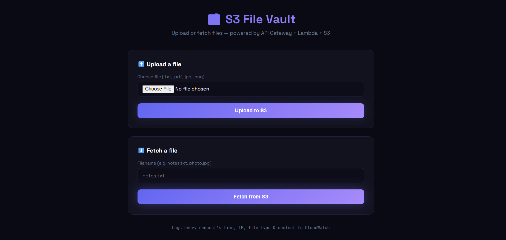
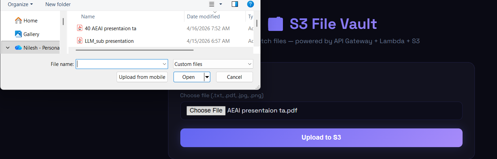
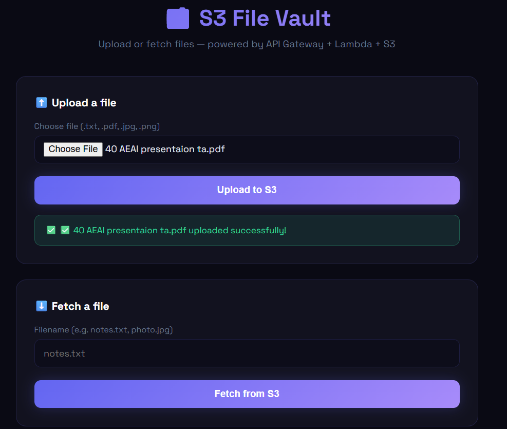
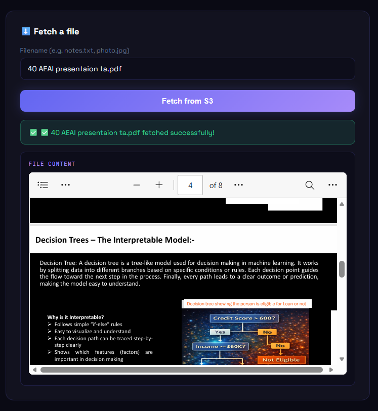
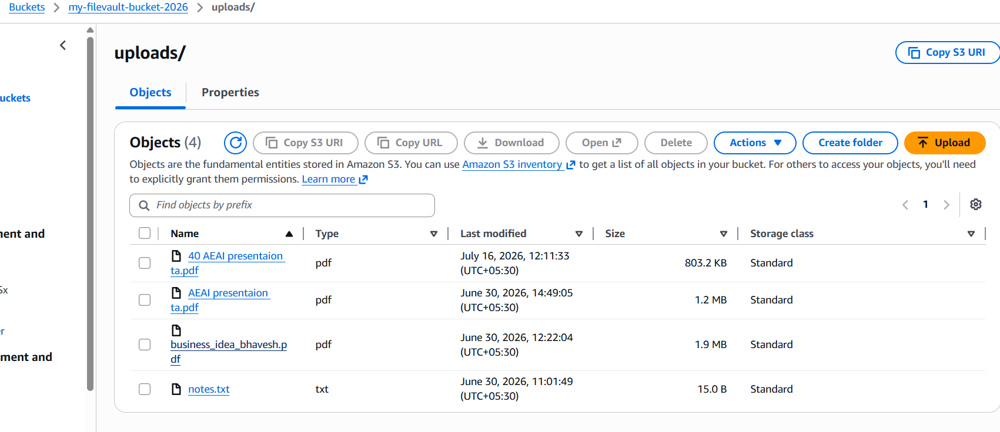
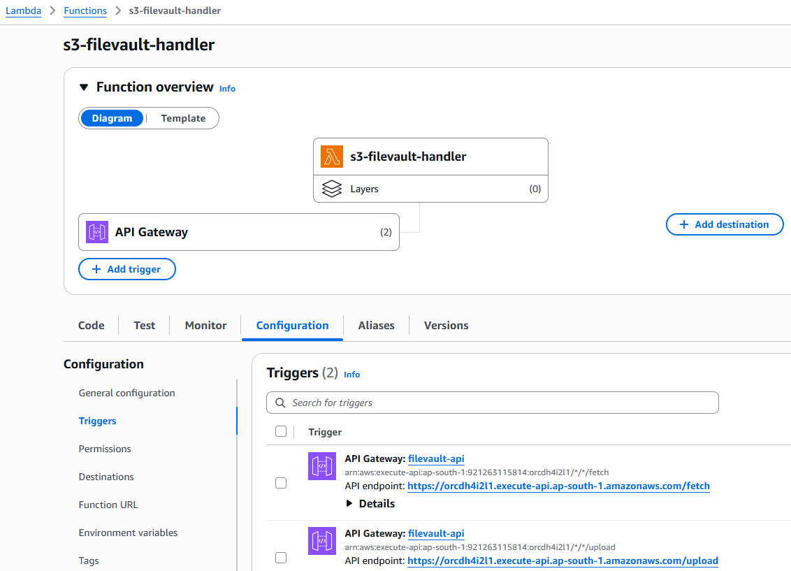
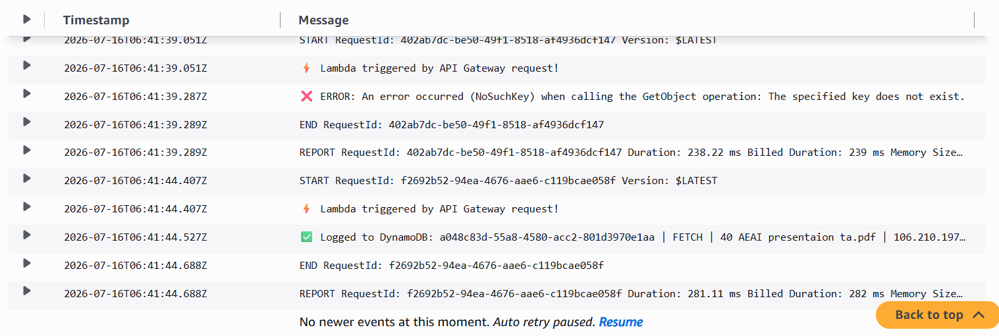

# 📁 S3 File Vault – Serverless File Upload & Retrieval on AWS

S3 File Vault is a serverless cloud-based file management application that allows users to securely upload and retrieve files through a responsive web interface. The application uses Amazon API Gateway to invoke AWS Lambda functions, which store and fetch files from Amazon S3 while automatically logging every request to Amazon CloudWatch for monitoring and auditing.

---

# 🚀 Features

The application provides a simple web interface for uploading and retrieving files while using a fully serverless AWS backend.

- Upload files securely to Amazon S3
- Retrieve stored files using filename
- REST API powered by Amazon API Gateway
- Serverless backend using AWS Lambda
- Automatic request logging in Amazon CloudWatch
- Displays uploaded file contents
- Responsive web interface
- Event-driven cloud architecture

---

# ☁️ AWS Services Used

- Amazon S3
- AWS Lambda
- Amazon API Gateway
- Amazon CloudWatch
- AWS IAM
- Amazon EC2
- GitHub

---

# 💻 Technologies

- Python
- HTML
- CSS
- JavaScript
- Boto3
- Ubuntu Linux
- VS Code
- Git & GitHub

---

# 📂 Project Workflow

```
            User
              │
              ▼
      Web Interface (EC2)
              │
              ▼
     Amazon API Gateway
              │
              ▼
      AWS Lambda Function
         ┌──────────────┐
         │              │
         ▼              ▼
   Upload to S3    Fetch from S3
         │              │
         └──────┬───────┘
                ▼
        Amazon CloudWatch
```

---

# 📁 Project Structure

```
S3_APIGateway_Lambda/
│
├── index.html
├── lambda_function.py
├── README.md
```

---

# 🔐 Security

- IAM Roles used for secure AWS access
- No direct Amazon S3 access from the browser
- REST API secured using Amazon API Gateway
- CloudWatch logs generated for every request
- Fully serverless architecture using AWS Lambda

---

# ⚙️ How It Works

1. User selects a file from the web application.
2. Browser sends the request to Amazon API Gateway.
3. API Gateway invokes the AWS Lambda function.
4. Lambda uploads or retrieves files from Amazon S3.
5. Lambda logs request details to Amazon CloudWatch.
6. User receives a success message or the requested file contents.

---

# 📊 CloudWatch Logging

Every upload and fetch request is logged with:

- Request Time
- Client IP Address
- Action (Upload / Fetch)
- File Name
- File Type
- File Content Preview

---

# 🚀 Future Enhancements

- User Authentication
- File Download History
- Presigned URL Support
- File Versioning
- Multi-file Upload
- File Encryption
- Search Files
- Amazon DynamoDB Metadata Storage

---

# 👨‍💻 Author

**Nilesh Rajendra Pardeshi**

- B.Tech – Artificial Intelligence & Machine Learning
- R. C. Patel Institute of Technology, Shirpur
- AWS with Python Course Trainee (Symbiosis, Sponsored by Capgemini)

---

# ⭐ Summary

S3 File Vault is a serverless cloud application that enables secure file upload and retrieval using Amazon API Gateway, AWS Lambda, and Amazon S3. The project demonstrates REST API development, event-driven architecture, secure cloud storage, and request monitoring through Amazon CloudWatch.

---

# 📸 Project Screenshots

## Home Page



---

## Upload File



---

## Upload Successful



---

## Fetch File



---

## Amazon S3 Bucket



---

## AWS Lambda Function & API Gateway



---

## Amazon CloudWatch Logs

