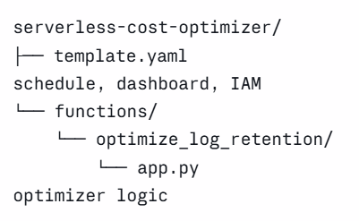
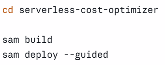
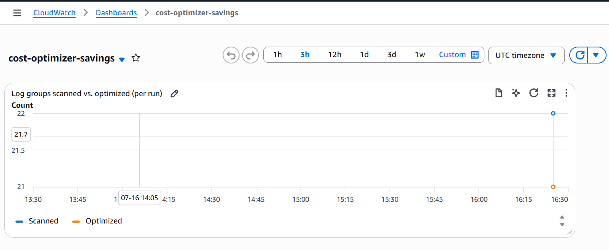
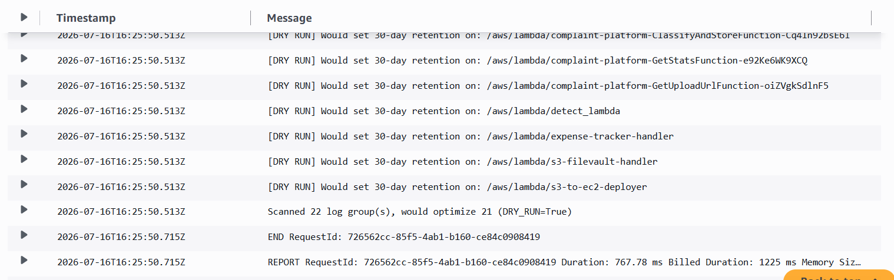

# 💰 Serverless Cost Optimizer – CloudWatch Log Retention Manager

Serverless Cost Optimizer is an AWS serverless application that automatically reduces CloudWatch log storage costs by identifying log groups without a retention policy and applying a configurable retention period. The solution is built using AWS Lambda, Amazon EventBridge, Amazon CloudWatch, AWS SAM, and CloudFormation, providing a fully automated cost optimization workflow.

---

# 🚀 Features

- Serverless architecture
- Automatic CloudWatch Log Group scanning
- Daily scheduled execution using Amazon EventBridge
- Configurable log retention period
- Dry Run mode for safe testing
- CloudWatch custom metrics
- CloudWatch dashboard for monitoring
- Infrastructure as Code using AWS SAM
- Least-privilege IAM permissions
- Automated AWS cost optimization

---

# ☁️ AWS Services Used

- AWS Lambda
- Amazon EventBridge
- Amazon CloudWatch
- AWS CloudFormation
- AWS SAM
- AWS IAM

---

# 💻 Technologies

- Python
- Boto3
- AWS SAM
- CloudFormation
- YAML
- Git & GitHub

---

# 📂 Project Workflow

```
        AWS SAM Deploy
               │
               ▼
      AWS CloudFormation
               │
               ▼
      Creates Lambda Function
               │
               ▼
 Creates Amazon EventBridge Rule
               │
               ▼
      Scheduled Daily Execution
               │
               ▼
 Scan CloudWatch Log Groups
               │
               ▼
 Check Retention Policy
               │
      ┌────────┴────────┐
      │                 │
 Has Retention      No Retention
      │                 │
      ▼                 ▼
 Skip Log Group   Apply Retention Policy
               │
               ▼
 Publish CloudWatch Metrics
               │
               ▼
 Update CloudWatch Dashboard
```

---

# 📁 Project Structure

```
serverless-cost-optimizer/

│
├── template.yaml
│
├── functions/
│   └── optimize_log_retention/
│       └── app.py
│
└── README.md
```

---

# 🔐 Security

- Least-privilege IAM Role
- Serverless execution using AWS Lambda
- No AWS Access Keys stored in source code
- Dry Run mode for safe deployment testing
- Infrastructure managed using AWS SAM

---

# ⚙️ How It Works

1. Deploy the application using AWS SAM.
2. CloudFormation provisions all required AWS resources.
3. Amazon EventBridge triggers the Lambda function every day.
4. Lambda scans all CloudWatch Log Groups.
5. Log groups without a retention policy are identified.
6. A configurable retention policy is automatically applied.
7. CloudWatch custom metrics are published.
8. Dashboard displays optimization statistics.

---

# 📊 CloudWatch Metrics

The application publishes custom metrics including:

- LogGroupsScanned
- LogGroupsOptimized

These metrics are displayed on a CloudWatch Dashboard to monitor optimization over time.

---

# 🚀 Future Enhancements

- Email notifications using Amazon SNS
- Exclude selected log groups
- Multi-region optimization
- Monthly cost savings reports
- AWS Organizations support
- Scheduled retention policy customization
- CloudWatch alarms for optimization failures

---

# 👨‍💻 Author

**Nilesh Rajendra Pardeshi**

- B.Tech – Artificial Intelligence & Machine Learning
- R. C. Patel Institute of Technology, Shirpur
- AWS with Python Course Trainee (Symbiosis, Sponsored by Capgemini)

---

# ⭐ Summary

Serverless Cost Optimizer is a practical AWS automation project that helps reduce unnecessary CloudWatch log storage costs by automatically applying retention policies to log groups without expiration settings. The project demonstrates serverless computing, Infrastructure as Code, scheduled automation, cloud monitoring, IAM security, and AWS cost optimization using AWS Lambda, Amazon EventBridge, CloudWatch, CloudFormation, and AWS SAM.

---

# 📸 Project Screenshots

## Project Architecture



---

## AWS SAM Deployment



---

## CloudWatch Dashboard





## CloudWatch Log Groups



---

## Successful Optimization

