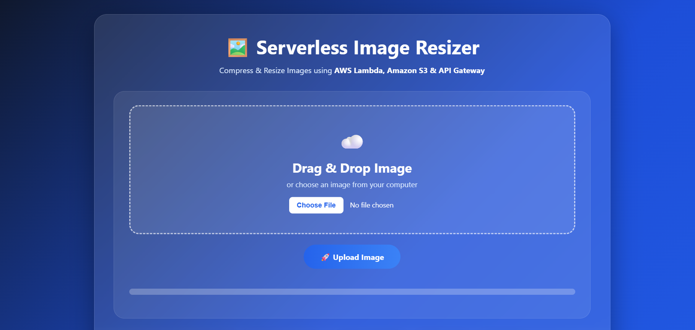
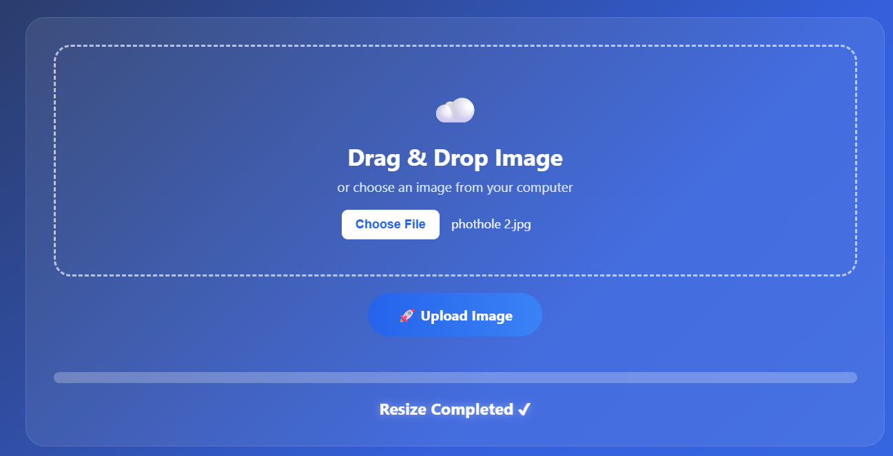
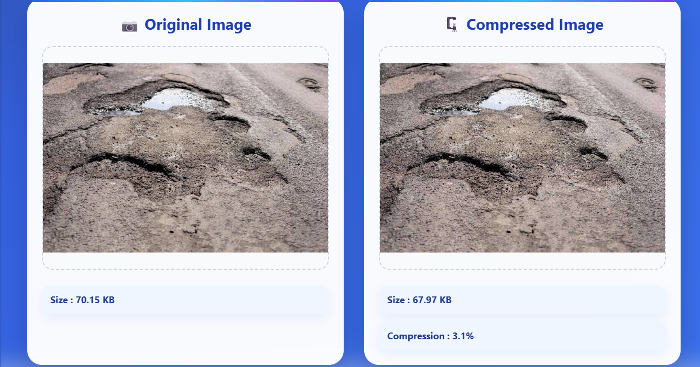
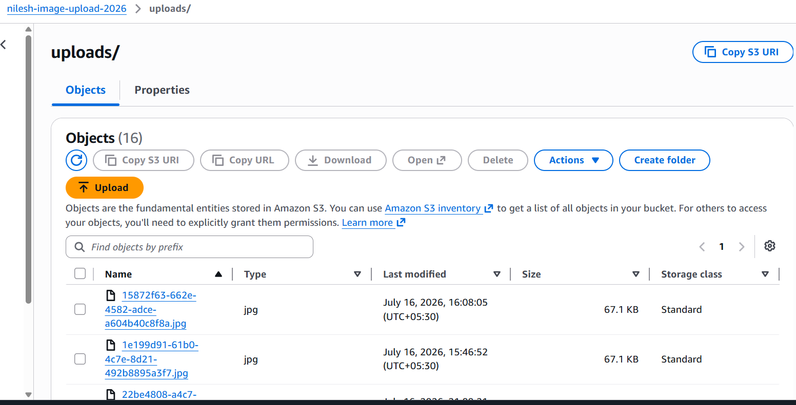
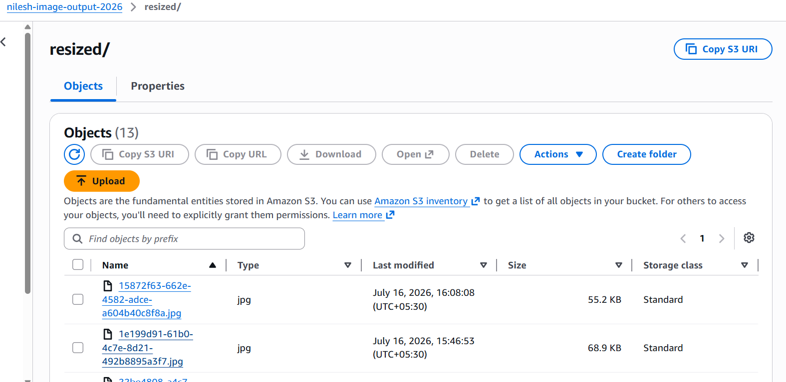
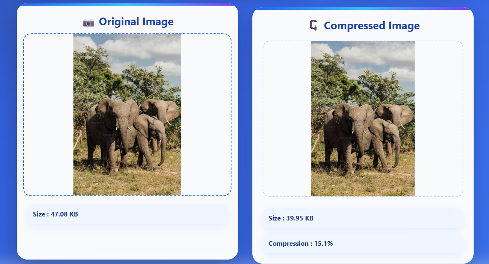

# 🖼️ Serverless Image Resizer – AWS Lambda Image Processing

Serverless Image Resizer is an event-driven cloud application that automatically resizes uploaded images using AWS Lambda and the Pillow library. When a user uploads an image to an Amazon S3 bucket, the upload event triggers a Lambda function that resizes the image and stores the processed version in a separate S3 bucket. The application demonstrates serverless image processing without managing any servers.

---

# 🚀 Features

- Upload images through a web interface
- Automatic image resizing using AWS Lambda
- Event-driven architecture with Amazon S3
- Process images using the Pillow library
- Store resized images in a separate S3 bucket
- Download processed images
- Serverless deployment
- Responsive frontend interface

---

# ☁️ AWS Services Used

- Amazon S3
- AWS Lambda
- AWS IAM

---

# 💻 Technologies

- Python
- HTML
- CSS
- JavaScript
- Boto3
- Pillow (Python Imaging Library)
- Git & GitHub

---

# 📂 Project Workflow

```
          User
            │
            ▼
      Web Application
            │
            ▼
 Upload Image to Amazon S3
            │
            ▼
    S3 Event Notification
            │
            ▼
      AWS Lambda Trigger
            │
            ▼
 Resize Image using Pillow
            │
            ▼
 Store Resized Image
     in Output S3 Bucket
            │
            ▼
 Download Processed Image
```

---

# 📁 Project Structure

```
serverless-image-resizer/

│
├── frontend/
│   ├── index.html
│   ├── style.css
│   └── script.js
│
├── lambda/
│   ├── lambda_function.py
│   └── requirements.txt
│
└── README.md
```

---

# 🔐 Security

- IAM Roles used for secure AWS resource access
- No AWS Access Keys stored in source code
- Serverless event-driven architecture
- Automatic execution through Amazon S3 events
- Secure image storage using Amazon S3

---

# ⚙️ How It Works

1. User uploads an image through the web interface.
2. The image is stored in the Amazon S3 Upload Bucket.
3. Amazon S3 triggers the AWS Lambda function.
4. Lambda uses the Pillow library to resize the image.
5. The resized image is saved to the Amazon S3 Output Bucket.
6. User downloads the processed image.

---

# 🚀 Future Enhancements

- Multiple image size options
- Image compression
- Watermark support
- Image format conversion (PNG, JPG, WebP)
- Batch image processing
- User authentication
- CloudFront CDN integration
- Image metadata storage using DynamoDB

---

# 👨‍💻 Author

**Nilesh Rajendra Pardeshi**

- B.Tech – Artificial Intelligence & Machine Learning
- R. C. Patel Institute of Technology, Shirpur
- AWS with Python Course Trainee (Symbiosis, Sponsored by Capgemini)

---

# ⭐ Summary

Serverless Image Resizer is an event-driven AWS application that automatically processes uploaded images using Amazon S3, AWS Lambda, and the Pillow library. The project demonstrates serverless computing, cloud storage, automated image processing, and scalable AWS architecture without managing servers.

---


# 📸 Project Screenshots

## Home Page




---

## Upload Image




---
## output





## AWS Lambda Trigger






---

## Resized Image in Output Bucket Resized Image



---

